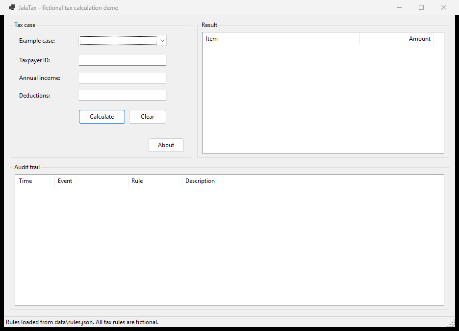

# JalaTax

JalaTax is a small VB.NET demo application that shows configurable business rules, input validation, rule processing, error handling, audit logging and unit testing.

> **Disclaimer:** JalaTax is a fictional demonstration. All tax rules, rates and data in this repository are made up for demo purposes. They are not current Finnish tax rules and do not reproduce or claim compatibility with any real tax administration system.

## Status

In progress. The solution structure, code standards, domain models, configuration loading, input validation, the tax calculation, the audit trail, the Windows Forms desktop application and the console runner are in place.



## Calculation rules

The fictional calculation follows these rules:

1. **Taxable income** = annual income − the case's deductions − the configured basic deduction, and never below 0.
2. **Progressive brackets:** each bracket's rate applies only to the part of taxable income inside that bracket. With the example brackets (0–20,000 at 10 %, 20,000–50,000 at 20 %, 50,000+ at 30 %), a taxable income of 42,500 is taxed 20,000 × 10 % + 22,500 × 20 % = 6,500.
3. **Bracket boundaries** include the lower bound and exclude the upper bound, so exactly 20,000 falls in the 20,000–50,000 bracket. The top bracket has no upper bound.
4. **Rounding:** amounts use `Decimal`, and the calculated tax is rounded to 2 decimals with halves rounded away from zero.

### How the rules are processed

`TaxCalculationService` handles one case at a time:

1. `TaxCaseValidator` checks the case. If it is invalid, the service returns the validation errors and does not calculate.
2. The rules run in order, sharing a `TaxCalculationContext`:
   - `DeductionRule` calculates taxable income (rule 1).
   - `TaxBracketRule` taxes each bracket's part and rounds the total (rules 2–4). It also records the tax per bracket.
3. The service returns a `CalculationOutcome` with the `TaxResult`, the tax per bracket and the validation result.

Each rule implements `ITaxRule` and can be tested on its own. The rules read all amounts from `data/rules.json`; no rates or limits are hard-coded.

Results for the example cases:

| Case | Income | Deductions | Basic deduction | Taxable income | Tax |
|---|---:|---:|---:|---:|---:|
| DEMO-001 | 45,000 | 2,500 | 3,000 | 39,500 | 20,000 × 10 % + 19,500 × 20 % = **5,900** |
| DEMO-002 | 68,000 | 1,200 | 3,000 | 63,800 | 2,000 + 6,000 + 13,800 × 30 % = **12,140** |
| DEMO-003 | 30,000 | −500 | – | – | Rejected: deductions must not be negative |

## Audit trail

Every processed case returns its audit trail in `CalculationOutcome.AuditEntries`. Each `AuditEntry` has a timestamp, an event type, a description and, for rule events, the rule name. The service records the case, validation and completion events; each rule records what it did.

Audit trail for DEMO-001:

| Event | Rule | Description |
|---|---|---|
| CaseLoaded | | Tax case DEMO-001 loaded |
| ValidationPassed | | Income and deductions validated |
| RuleApplied | DeductionRule | Deductions applied: taxable income 39,500.00 (income 45,000.00 − deductions 2,500.00 − basic deduction 3,000.00, not below 0.00) |
| RuleApplied | TaxBracketRule | Tax bracket 0.00–20,000.00 at 10 %: 20,000.00 taxed, tax 2,000.00 |
| RuleApplied | TaxBracketRule | Tax bracket 20,000.00–50,000.00 at 20 %: 19,500.00 taxed, tax 3,900.00 |
| CalculationCompleted | | Calculation completed: taxable income 39,500.00, calculated tax 5,900.00 |

An invalid case records one `ValidationFailed` entry per problem, and processing stops there.

- **Numbers** in audit text always use the same format (`45,000.00`), whatever the computer's regional settings.
- **Timestamps** come from .NET's `TimeProvider`, so tests use a fixed clock.
- **Identifiers:** entries contain only the fictional case ID and amounts.

## Configuration

The rules are read from [data/rules.json](data/rules.json):

```json
{
  "basicDeduction": 3000,
  "taxBrackets": [
    { "min": 0,     "max": 20000, "rate": 0.10 },
    { "min": 20000, "max": 50000, "rate": 0.20 },
    { "min": 50000, "max": null,  "rate": 0.30 }
  ]
}
```

`basicDeduction`, `taxBrackets`, `min` and `rate` are required; `max` is left out or `null` only for the last bracket. Comments and trailing commas are allowed.

`TaxRuleConfigurationLoader` rejects the file with a `ConfigurationException` that lists every problem found when:

- the file is missing or cannot be read
- the JSON is malformed, a required value is missing, or a property name is unknown (for example a typo)
- the basic deduction is negative or a rate is outside 0–1
- there are no brackets, the first bracket does not start at 0, brackets have gaps or overlaps, `max` is not greater than `min`, or an open-ended bracket is not the last one

## Tax case input

Example cases are read from [data/example-taxpayer.json](data/example-taxpayer.json), a JSON array of cases with fictional IDs:

```json
[
  { "taxpayerId": "DEMO-001", "annualIncome": 45000, "deductions": 2500 },
  { "taxpayerId": "DEMO-002", "annualIncome": 68000, "deductions": 1200 },
  { "taxpayerId": "DEMO-003", "annualIncome": 30000, "deductions": -500 }
]
```

`DEMO-003` is intentionally invalid, to demonstrate validation.

Loading and validation are separate steps:

- **`TaxCaseLoader`** checks only the file structure. It throws an `InputDataException` if the file is missing or unreadable, the JSON is malformed, the list is empty or has empty entries, a required value (`taxpayerId`, `annualIncome`, `deductions`) is missing, or a property name is unknown.
- **`TaxCaseValidator`** checks the values of each case before calculation and returns every problem at once:
  - Taxpayer ID is required.
  - Annual income must not be negative.
  - Deductions must not be negative.

  Deductions larger than income are allowed; taxable income is then 0.

## Technology stack

- VB.NET on .NET 10
- Windows Forms desktop application (main UI), console runner and class library
- MSTest (Microsoft.Testing.Platform runner)
- System.Text.Json and JSON configuration files

## Project structure

```text
JalaTax/
├── JalaTax.sln
├── Directory.Build.props      Shared build settings and code validation
├── .editorconfig              Formatting, code style and naming rules
├── global.json                .NET SDK version and test runner
├── src/
│   ├── JalaTax.Core/          Domain models and business logic
│   ├── JalaTax.WinForms/      Windows Forms desktop app (main UI)
│   └── JalaTax.Console/       Command-line runner
├── tests/
│   └── JalaTax.Tests/         MSTest tests for JalaTax.Core
├── data/                      JSON rules and example input
└── docs/screenshots/          Screenshots of the desktop app
```

`JalaTax.Core` must not depend on the Windows Forms or console applications. See [AGENTS.md](AGENTS.md) for the full architecture and coding guidelines.

## Prerequisites

- [.NET 10 SDK](https://dotnet.microsoft.com/download/dotnet/10.0) (10.0.100 or a later 10.0 feature band)
- Optional: Visual Studio 2026, Visual Studio Code with the C# Dev Kit, or JetBrains Rider

Check the installed SDK:

```powershell
dotnet --version
```

## Build and run

From the repository root:

```powershell
dotnet restore
dotnet build
```

### Desktop application (Windows)

```powershell
dotnet run --project src/JalaTax.WinForms
```

1. Pick an example case (`DEMO-001` to `DEMO-003`), or type a taxpayer ID, annual income and deductions.
2. Press **Calculate** (or Enter).
3. The **Result** panel shows the amounts and the tax per bracket. The **Audit trail** lists every processing step. Invalid input is marked next to the field, with the message below the buttons.

Amounts can be typed in your regional format (for example `45000,50` with Finnish settings). Results always use the same format as the console (`45,000.50`).


| Top bracket (DEMO-002) | Validation error (DEMO-003) |
|---|---|
|  |  |

**About** shows the application version:


The desktop app needs Windows. The rest of the solution builds and runs on any platform.

### Console runner

```powershell
dotnet run --project src/JalaTax.Console
dotnet run --project src/JalaTax.Console -- path\to\cases.json
```

The runner processes `data/example-taxpayer.json`, or the file given as an argument:

```text
JalaTax 1.0.0
----------------------------------------

Processing case: DEMO-001

Validation
✓ Income and deductions validated

Rules
✓ Deductions applied: taxable income 39,500.00 (income 45,000.00 − deductions 2,500.00 − basic deduction 3,000.00, not below 0.00)
✓ Tax bracket 0.00–20,000.00 at 10 %: 20,000.00 taxed, tax 2,000.00
✓ Tax bracket 20,000.00–50,000.00 at 20 %: 19,500.00 taxed, tax 3,900.00

Result
----------------------------------------
Annual income:         45,000.00
Deductions:             2,500.00
Basic deduction:        3,000.00
Taxable income:        39,500.00
Calculated tax:         5,900.00

...

Processing case: DEMO-003

Validation
✗ Deductions must not be negative.

Case rejected. No tax calculated.

----------------------------------------
Processed 3 cases: 2 calculated, 1 rejected.
Demo calculation completed.
```

Exit codes:

| Code | Meaning |
|---|---|
| 0 | Success. Rejected cases are part of normal output. |
| 1 | Configuration error |
| 2 | Input file error |
| 3 | Unexpected error |

### IDEs

- **Visual Studio:** open `JalaTax.sln`, set **JalaTax.WinForms** (or **JalaTax.Console**) as the startup project and press **F5**. The form can be edited in the Windows Forms designer.
- **Visual Studio Code:** install the recommended extensions when prompted (C# and EditorConfig), choose the **JalaTax.WinForms** or **JalaTax.Console** launch configuration and press **F5**. Breakpoints work. **Terminal → Run Task** also offers `build`, `test` and `format`. VS Code can't edit forms visually, and its VB.NET editor support is more limited than Visual Studio's.

## Run tests

```powershell
dotnet test
```

## Code validation and standards

The rules are enforced automatically, so a local build fails the same way CI does.

| What | Where | Enforced by |
|---|---|---|
| `Option Strict On`, `Option Explicit On`, `Option Infer On` | `Directory.Build.props` | Compiler |
| Warnings treated as errors | `Directory.Build.props` | Compiler |
| .NET analyzers (`latest-recommended`) | `Directory.Build.props` | Build |
| Formatting, code style, naming conventions | `.editorconfig` | Build and `dotnet format` |
| Format, build and test on every push and pull request | `.github/workflows/ci.yml` | GitHub Actions |

Naming conventions: PascalCase for types and public members, camelCase for parameters and locals, and an `I` prefix for interfaces. Test methods use the `Method_WhenCondition_ExpectedResult` pattern.

Before opening a pull request, run:

```powershell
dotnet format --verify-no-changes
dotnet build
dotnet test
```

To fix formatting and code style issues automatically:

```powershell
dotnet format
```

## Versioning

The version is set once, in `Directory.Build.props` (`<Version>1.0.0</Version>`), and every project uses it. The desktop app's **About** dialog and the console header (`JalaTax 1.0.0`) read it through `ApplicationInfo.Version` in `JalaTax.Core`. To release a new version, update that value, following [semantic versioning](https://semver.org/) (major.minor.patch).

## Contributing

Work happens on feature branches (for example `feature/configurable-tax-rules`) and is merged to `main` through a pull request that a human reviews. The pull request template lists what to describe and check.
