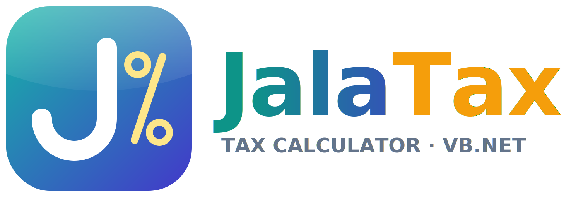
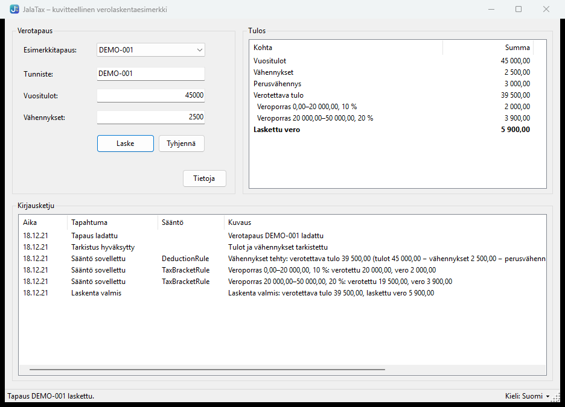
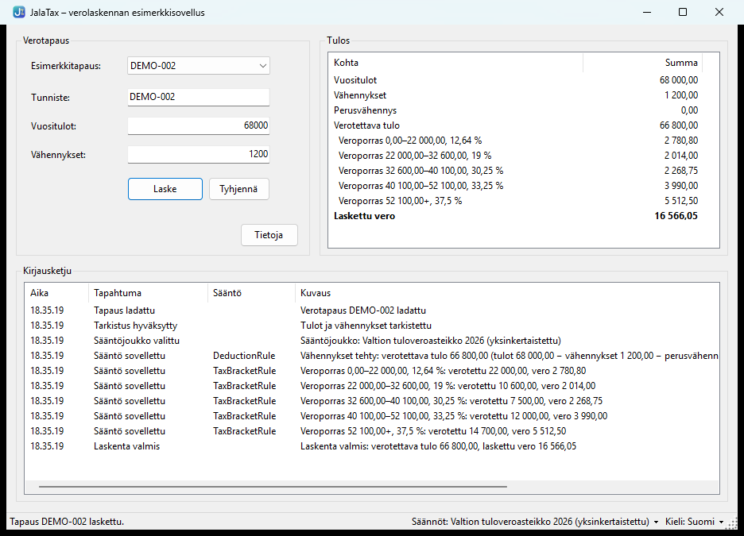
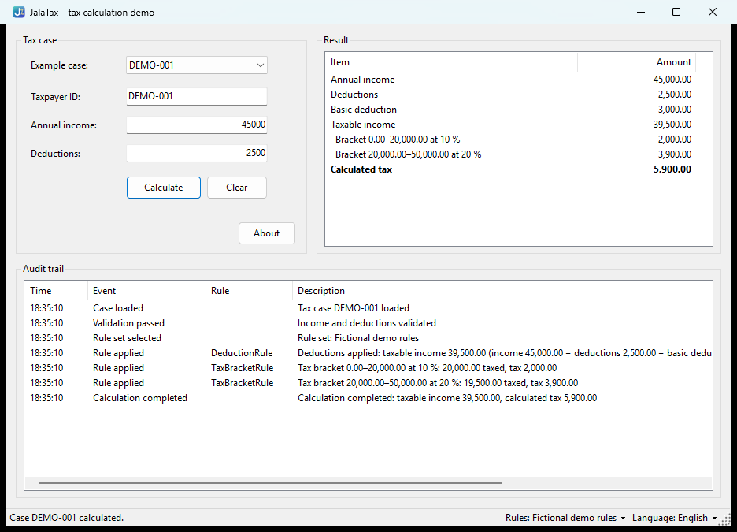
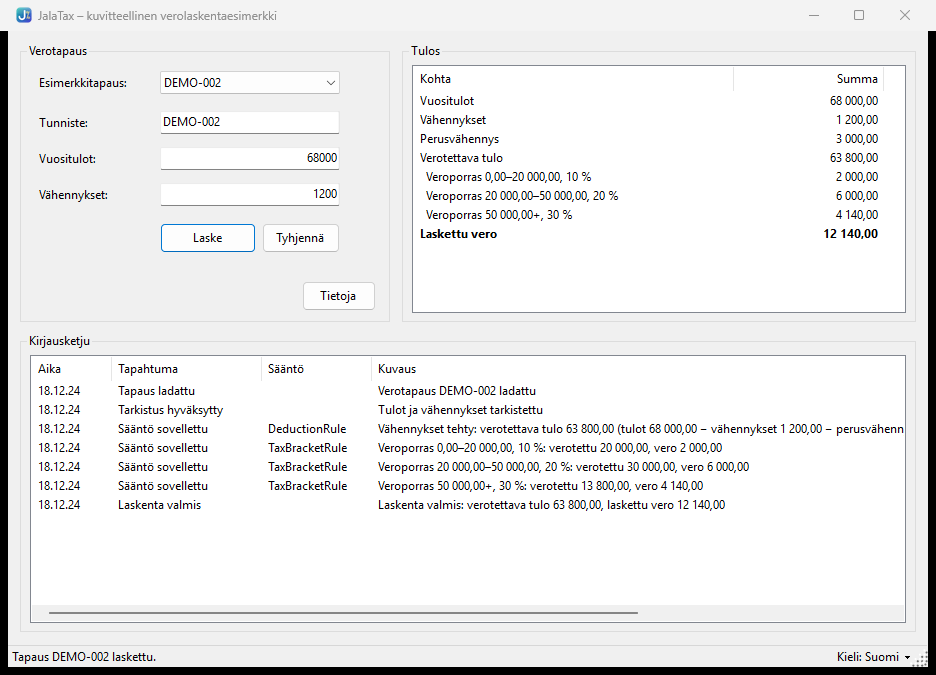
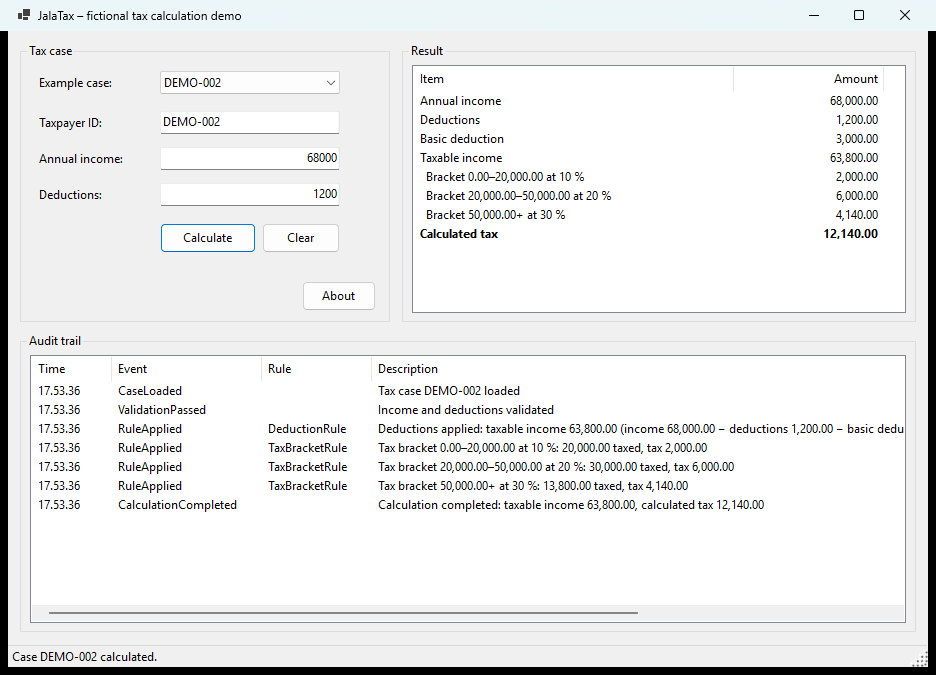
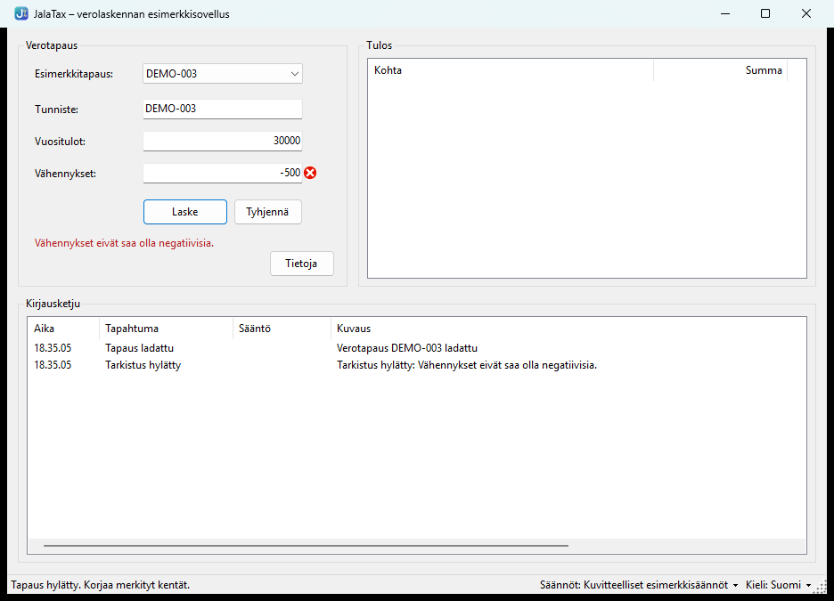
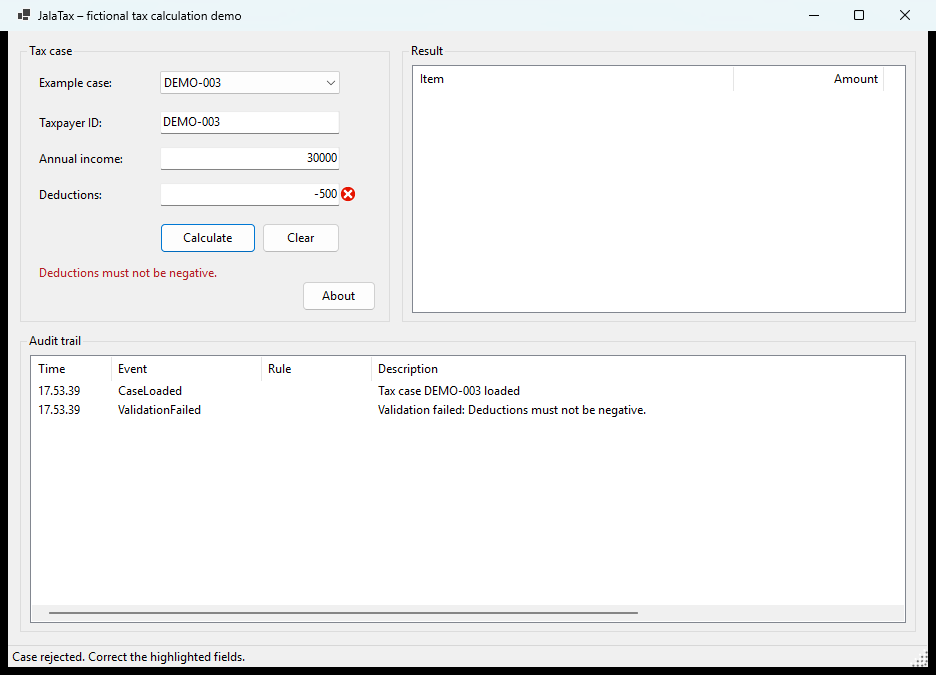
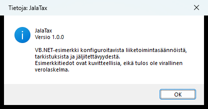
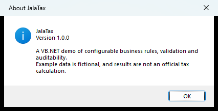

# JalaTax

<p align="center">
  
</p>

JalaTax is a small VB.NET demo application that shows configurable business rules, input validation, rule processing, error handling, audit logging and unit testing.

**Suomeksi:** [README.fi.md](README.fi.md) has a Finnish summary and user guide (tiivistelmä ja käyttöohje).

> **Disclaimer:** JalaTax is a demonstration, and **no result is an official tax calculation**. The default rules and all example data are fictional. The optional rule set `data/rules-fi-2026.json` uses the published 2026 Finnish state income tax scale, simplified to state income tax only (see [Rule sets](#rule-sets)). JalaTax does not reproduce or claim compatibility with any real tax administration system.

## Status

Version 1.0.0. The solution structure, code standards, domain models, configuration loading, input validation, the tax calculation, the audit trail, the Windows Forms desktop application, the console runner, Finnish/English translations and selectable rule sets (including the simplified 2026 Finnish state income tax scale) are in place.



## Calculation rules

Every rule set is calculated with the same rules:

1. **Taxable income** = annual income − the case's deductions − the configured basic deduction, and never below 0.
2. **Progressive brackets:** each bracket's rate applies only to the part of taxable income inside that bracket. With the example brackets (0–20,000 at 10 %, 20,000–50,000 at 20 %, 50,000+ at 30 %), a taxable income of 42,500 is taxed 20,000 × 10 % + 22,500 × 20 % = 6,500.
3. **Bracket boundaries** include the lower bound and exclude the upper bound, so exactly 20,000 falls in the 20,000–50,000 bracket. The top bracket has no upper bound.
4. **Rounding:** amounts use `Decimal`, and the calculated tax is rounded to 2 decimals with halves rounded away from zero.

### How the rules are processed

`TaxCalculationService` handles one case at a time:

1. `TaxCaseValidator` checks the case. If it is invalid, the service returns the validation errors and does not calculate.
2. The rules run in order, sharing a `TaxCalculationContext`:
   - `DeductionRule` calculates taxable income (rule 1).
   - `TaxBracketRule` taxes each bracket's part and rounds the total (rules 2–4). It also records the tax per bracket.
3. The service returns a `CalculationOutcome` with the `TaxResult`, the tax per bracket and the validation result.

Each rule implements `ITaxRule` and can be tested on its own. The rules read all amounts from the selected rule set file; no rates or limits are hard-coded.

Results for the example cases with the default (fictional) rules:

| Case | Income | Deductions | Basic deduction | Taxable income | Tax |
|---|---:|---:|---:|---:|---:|
| DEMO-001 | 45,000 | 2,500 | 3,000 | 39,500 | 20,000 × 10 % + 19,500 × 20 % = **5,900** |
| DEMO-002 | 68,000 | 1,200 | 3,000 | 63,800 | 2,000 + 6,000 + 13,800 × 30 % = **12,140** |
| DEMO-003 | 30,000 | −500 | – | – | Rejected: deductions must not be negative |

## Audit trail

Every processed case returns its audit trail in `CalculationOutcome.AuditEntries`. Each `AuditEntry` has a timestamp, an event type, a description and, for rule events, the rule name. The service records the case, validation and completion events; each rule records what it did.

Audit trail for DEMO-001:

| Event | Rule | Description |
|---|---|---|
| CaseLoaded | | Tax case DEMO-001 loaded |
| ValidationPassed | | Income and deductions validated |
| RuleSetSelected | | Rule set: Fictional demo rules |
| RuleApplied | DeductionRule | Deductions applied: taxable income 39,500.00 (income 45,000.00 − deductions 2,500.00 − basic deduction 3,000.00, not below 0.00) |
| RuleApplied | TaxBracketRule | Tax bracket 0.00–20,000.00 at 10 %: 20,000.00 taxed, tax 2,000.00 |
| RuleApplied | TaxBracketRule | Tax bracket 20,000.00–50,000.00 at 20 %: 19,500.00 taxed, tax 3,900.00 |
| CalculationCompleted | | Calculation completed: taxable income 39,500.00, calculated tax 5,900.00 |

An invalid case records one `ValidationFailed` entry per problem, and processing stops there.

- **Numbers** in audit text follow the application language (`45,000.00` in English, `45 000,00` in Finnish), not the computer's regional settings.
- **Rule set:** the entry `RuleSetSelected` records which rule set produced the result.
- **Timestamps** come from .NET's `TimeProvider`, so tests use a fixed clock.
- **Identifiers:** entries contain only the fictional case ID and amounts.

## Configuration

The rules are read from a rule set file, by default [data/rules.json](data/rules.json):

```json
{
  "names": { "fi": "Kuvitteelliset esimerkkisäännöt", "en": "Fictional demo rules" },
  "basicDeduction": 3000,
  "taxBrackets": [
    { "min": 0,     "max": 20000, "rate": 0.10 },
    { "min": 20000, "max": 50000, "rate": 0.20 },
    { "min": 50000, "max": null,  "rate": 0.30 }
  ]
}
```

`basicDeduction`, `taxBrackets`, `min` and `rate` are required; `max` is left out or `null` only for the last bracket. `names` (the rule set's name per language) is optional. Comments and trailing commas are allowed.

`TaxRuleConfigurationLoader` rejects the file with a `ConfigurationException` that lists every problem found when:

- the file is missing or cannot be read
- the JSON is malformed, a required value is missing, or a property name is unknown (for example a typo)
- the basic deduction is negative or a rate is outside 0–1
- there are no brackets, the first bracket does not start at 0, brackets have gaps or overlaps, `max` is not greater than `min`, or an open-ended bracket is not the last one

### Rule sets

Every `data/rules*.json` file is a rule set. Two are included:

| File | Name | Content |
|---|---|---|
| `rules.json` (default) | Fictional demo rules | Made-up basic deduction and three brackets |
| `rules-fi-2026.json` | State income tax scale 2026 (simplified) | The published 2026 Finnish state income tax scale |

**Choosing a rule set:**
- **Desktop app:** the **Säännöt / Rules** switcher in the status bar, or `--rules rules-fi-2026.json` at startup.
- **Console:** `--rules <path>`.

The audit trail records the rule set used.

**The 2026 state income tax scale** comes from *Laki vuoden 2026 tuloveroasteikosta* (1140/2025):

| Taxable earned income (€) | Tax at lower limit (€) | Rate on the excess |
|---|---:|---:|
| 0 – 22,000 | 0.00 | 12.64 % |
| 22,000 – 32,600 | 2,780.80 | 19.00 % |
| 32,600 – 40,100 | 4,794.80 | 30.25 % |
| 40,100 – 52,100 | 7,063.55 | 33.25 % |
| 52,100 – | 11,053.55 | 37.50 % |

It is **simplified on purpose**: only the state income tax on taxable earned income is calculated.
- **Left out:** municipal tax, church tax, health insurance contributions, and tax credits such as the earned income deduction (työtulovähennys).
- **Deductions:** the case's deductions are subtracted from income, and there is no basic deduction.
- **Tests:** the engine reproduces the published "tax at lower limit" for every bracket.

| Case | Taxable income | State income tax |
|---|---:|---:|
| DEMO-001 | 42,500 | **7,861.55** |
| DEMO-002 | 66,800 | **16,566.05** |



## Tax case input

Example cases are read from [data/example-taxpayer.json](data/example-taxpayer.json), a JSON array of cases with fictional IDs:

```json
[
  { "taxpayerId": "DEMO-001", "annualIncome": 45000, "deductions": 2500 },
  { "taxpayerId": "DEMO-002", "annualIncome": 68000, "deductions": 1200 },
  { "taxpayerId": "DEMO-003", "annualIncome": 30000, "deductions": -500 }
]
```

`DEMO-003` is intentionally invalid, to demonstrate validation.

Loading and validation are separate steps:

- **`TaxCaseLoader`** checks only the file structure. It throws an `InputDataException` if the file is missing or unreadable, the JSON is malformed, the list is empty or has empty entries, a required value (`taxpayerId`, `annualIncome`, `deductions`) is missing, or a property name is unknown.
- **`TaxCaseValidator`** checks the values of each case before calculation and returns every problem at once:
  - Taxpayer ID is required.
  - Annual income must not be negative.
  - Deductions must not be negative.

  Deductions larger than income are allowed; taxable income is then 0.

## Languages

JalaTax is available in **Finnish (default)** and **English**. Everything the user sees is translated: form texts, validation and configuration messages, file errors, audit trail descriptions and console output.

| | Finnish | English |
|---|---|---|
| Choose | default, or `--lang fi` | `--lang en` |
| Desktop app | **Kieli: Suomi** in the status bar | **Language: English** in the status bar |
| Amounts | `45 000,00` | `45,000.00` |
| Rates | `12,5 %` | `12.5 %` |
| Times | `14.05.09` | `14:05:09` |

- **Where texts live:** .NET resource files. `Strings.resx` / `Strings.fi.resx` in `JalaTax.Core` hold messages, audit texts and shared labels. `UiText` (desktop app) and `ConsoleText` (console) hold the app-specific texts. English is the neutral language, and Finnish is built into a satellite assembly (`fi\*.resources.dll`).
- **Only texts change with the language.** Calculated amounts, validation rules and field names (`PropertyName`) stay the same.
- **Tests check the translations:** every text exists in both languages, and every text key used in the code exists.
- **Adding a text:** add it to both `.resx` files of the project, then read it with `CoreText.Get`, `UiText.Get` or `ConsoleText.Get`.

## Technology stack

- VB.NET on .NET 10
- Windows Forms desktop application (main UI), console runner and class library
- MSTest (Microsoft.Testing.Platform runner)
- System.Text.Json and JSON configuration files

## Project structure

```text
JalaTax/
├── JalaTax.sln
├── Directory.Build.props      Shared build settings and code validation
├── .editorconfig              Formatting, code style and naming rules
├── global.json                .NET SDK version and test runner
├── src/
│   ├── JalaTax.Core/          Domain models and business logic
│   ├── JalaTax.WinForms/      Windows Forms desktop app (main UI)
│   └── JalaTax.Console/       Command-line runner
├── tests/
│   └── JalaTax.Tests/         MSTest tests for JalaTax.Core
├── data/                      JSON rules and example input
├── assets/                    Logo and application icon
└── docs/screenshots/          Screenshots of the desktop app
```

`JalaTax.Core` must not depend on the Windows Forms or console applications. See [AGENTS.md](AGENTS.md) for the full architecture and coding guidelines.

## Prerequisites

- [.NET 10 SDK](https://dotnet.microsoft.com/download/dotnet/10.0) (10.0.100 or a later 10.0 feature band)
- Optional: Visual Studio 2026, Visual Studio Code with the C# Dev Kit, or JetBrains Rider

Check the installed SDK:

```powershell
dotnet --version
```

## Build and run

From the repository root:

```powershell
dotnet restore
dotnet build
```

### Desktop application (Windows)

```powershell
dotnet run --project src/JalaTax.WinForms                                # Finnish (default)
dotnet run --project src/JalaTax.WinForms -- --lang en                   # English
dotnet run --project src/JalaTax.WinForms -- --rules rules-fi-2026.json  # 2026 state income tax scale
```

1. Pick an example case (`DEMO-001` to `DEMO-003`), or type a taxpayer ID, annual income and deductions.
2. Press **Laske** / **Calculate** (or Enter).
3. The **Tulos** / **Result** panel shows the amounts and the tax per bracket. The **Kirjausketju** / **Audit trail** lists every processing step. Invalid input is marked next to the field, with the message below the buttons.
4. Switch the rule set from **Säännöt** / **Rules** and the language from **Kieli: Suomi** / **Language: English** at the bottom right. The current case is recalculated after either switch.

Amounts can be typed in your regional format (for example `45000,50` with Finnish regional settings).

| Finnish (default) | English |
|---|---|
|  |  |
|  |  |
|  |  |

**Tietoja** / **About** shows the application version:

| Finnish | English |
|---|---|
|  |  |

The desktop app needs Windows. The rest of the solution builds and runs on any platform.

### Console runner

```powershell
dotnet run --project src/JalaTax.Console                                     # Finnish (default)
dotnet run --project src/JalaTax.Console -- --lang en                        # English
dotnet run --project src/JalaTax.Console -- --rules data/rules-fi-2026.json  # 2026 state income tax scale
dotnet run --project src/JalaTax.Console -- --lang en path\to\cases.json
```

`--rules` takes a file path (relative to the current directory, or absolute). Without it, the runner uses the demo rules next to the program. It processes `data/example-taxpayer.json`, or the file given as an argument:

```text
JalaTax 1.0.0
----------------------------------------
Sääntöjoukko: Kuvitteelliset esimerkkisäännöt
Esimerkkilaskenta, ei virallinen verolaskelma.

Käsitellään tapausta: DEMO-001

Tarkistus
✓ Tulot ja vähennykset tarkistettu

Säännöt
✓ Vähennykset tehty: verotettava tulo 39 500,00 (tulot 45 000,00 − vähennykset 2 500,00 − perusvähennys 3 000,00, vähintään 0,00)
✓ Veroporras 0,00–20 000,00, 10 %: verotettu 20 000,00, vero 2 000,00
✓ Veroporras 20 000,00–50 000,00, 20 %: verotettu 19 500,00, vero 3 900,00

Tulos
----------------------------------------
Vuositulot:            45 000,00
Vähennykset:            2 500,00
Perusvähennys:          3 000,00
Verotettava tulo:      39 500,00
Laskettu vero:          5 900,00

...

Käsitellään tapausta: DEMO-003

Tarkistus
✗ Vähennykset eivät saa olla negatiivisia.

Tapaus hylätty. Veroa ei laskettu.

----------------------------------------
Käsitelty 3 tapausta: 2 laskettu, 1 hylätty.
Esimerkkilaskenta valmis.
```

With `--lang en` the same output is in English (`Processing case: DEMO-001`, `Calculated tax:  5,900.00`, …).

Exit codes:

| Code | Meaning |
|---|---|
| 0 | Success. Rejected cases are part of normal output. |
| 1 | Configuration error |
| 2 | Input file error |
| 3 | Unexpected error |
| 4 | Invalid `--lang` or `--rules` option |

### IDEs

- **Visual Studio:** open `JalaTax.sln`, set **JalaTax.WinForms** (or **JalaTax.Console**) as the startup project and press **F5**. The form can be edited in the Windows Forms designer.
- **Visual Studio Code:** install the recommended extensions when prompted (C# and EditorConfig), choose the **JalaTax.WinForms** or **JalaTax.Console** launch configuration and press **F5**. Breakpoints work. **Terminal → Run Task** also offers `build`, `test` and `format`. VS Code can't edit forms visually, and its VB.NET editor support is more limited than Visual Studio's.

## Run tests

```powershell
dotnet test
```

## Code validation and standards

The rules are enforced automatically, so a local build fails the same way CI does.

| What | Where | Enforced by |
|---|---|---|
| `Option Strict On`, `Option Explicit On`, `Option Infer On` | `Directory.Build.props` | Compiler |
| Warnings treated as errors | `Directory.Build.props` | Compiler |
| .NET analyzers (`latest-recommended`) | `Directory.Build.props` | Build |
| Formatting, code style, naming conventions | `.editorconfig` | Build and `dotnet format` |
| Format, build and test on every push and pull request | `.github/workflows/ci.yml` | GitHub Actions |

Naming conventions: PascalCase for types and public members, camelCase for parameters and locals, and an `I` prefix for interfaces. Test methods use the `Method_WhenCondition_ExpectedResult` pattern.

Before opening a pull request, run:

```powershell
dotnet format --verify-no-changes
dotnet build
dotnet test
```

To fix formatting and code style issues automatically:

```powershell
dotnet format
```

## Versioning and releases

JalaTax uses [semantic versioning](https://semver.org/):
- **major:** incompatible changes, such as a new rule file format
- **minor:** new features
- **patch:** fixes

The version is set once, in `Directory.Build.props` (`<Version>1.0.0</Version>`), and every project uses it. The desktop app's **About** dialog and the console header (`JalaTax 1.0.0`) read it through `ApplicationInfo.Version`.

**Changes are recorded in [CHANGELOG.md](CHANGELOG.md)** ([Keep a Changelog](https://keepachangelog.com/) format). Every pull request adds its user-visible changes under `## [Unreleased]`.

**Each release is a Git tag `vX.Y.Z` with a GitHub Release.** The [release workflow](.github/workflows/release.yml) creates both automatically.

To release a new version:

1. In a pull request, set the new `<Version>` in `Directory.Build.props`.
2. In `CHANGELOG.md`, rename `## [Unreleased]` to `## [X.Y.Z] - YYYY-MM-DD`, add a new empty `## [Unreleased]` above it, and add the link definitions at the bottom.
3. Merge the pull request. On `main`, the workflow notices that tag `vX.Y.Z` does not exist yet. It builds and tests the solution, creates the tag, and publishes a GitHub Release. The release notes are the version's changelog section, and two zip packages are attached:
   - `JalaTax-X.Y.Z-windows-x64.zip`: the desktop app (needs the .NET 10 Desktop Runtime)
   - `JalaTax-X.Y.Z-console.zip`: the console runner (needs the .NET 10 Runtime, any OS)

You can also push a tag yourself (`git tag v1.1.0 && git push origin v1.1.0`). The workflow then releases it, after checking that the tag matches `Directory.Build.props`.

Two safety nets:
- **Tests:** they check that `CHANGELOG.md` has a section for the current version, so a version bump without release notes fails CI before anything is released.
- **No overwrites:** an existing release is never replaced.

## Contributing

Work happens on feature branches (for example `feature/configurable-tax-rules`) and is merged to `main` through a pull request that a human reviews. The pull request template lists what to describe and check. Only the owner can change `main` and publish releases. Suggestions are welcome as issues.

## Copyright

© 2026 Jussi Alanen. All rights reserved.

The source code is public for viewing and review only. No license is granted to copy, modify or distribute it.
